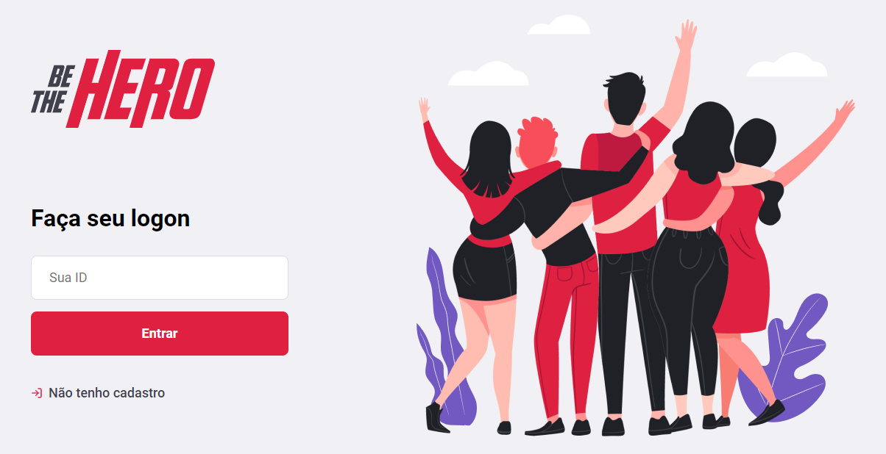

<h1 align="center">
    
</h1>

<h3 align="center" >
  An application where you can be the hero and save the world, but not by the conventional way, but by helping some NGOs to raise funds for their causes
</h3>

 Project developed on SemanaOmnistack 11.0 - RocketSeat 

## :computer: Languages

- **HTML**
- **CSS**
- **Javascript**

## :books: Technologies

* <a href="https://github.com/Thiagodemas/be-the-hero-api"> **Backend: Node.js** </a>
* <a href="https://github.com/Thiagodemas/be-the-hero"> **Frontend: React.js** </a>
* <a href="https://github.com/Thiagodemas/be-the-hero-app"> **Mobile: React Native** </a>

